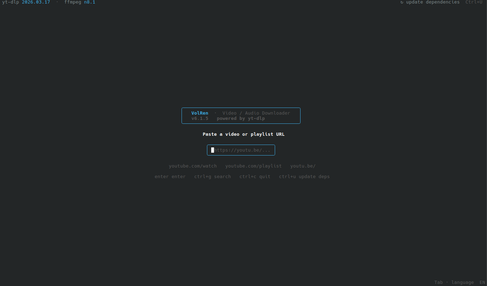

# VolRen Video / Audio Downloader

<div align="center">


**Download video and audio from YouTube through a terminal UI or Telegram bot.**


</div>

---

## About



**VolRen Downloader** is a compact YouTube downloader built around **yt-dlp**.

The project includes:

- a keyboard-driven **TUI** built on [Bubble Tea v2](https://charm.land/bubbletea/v2)
- an optional **Telegram bot** for downloading by URL or by YouTube search

On first run the app prepares **yt-dlp** inside `_deps/`. On Windows, **ffmpeg** can also be downloaded on demand. The interface is available in **English** and **Russian**; press **Tab** in the TUI to switch language.

---

## Features

### TUI

- **Best / Economy video presets** with quality scan via yt-dlp
- **Audio-only mode** with 5 presets: MP3 320k, MP3 192k, M4A/AAC Best, Opus Best, FLAC
- **Thumbnail download**
- **Playlist browser** with Space toggles, manual ranges and multi-worker downloads
- **YouTube search** from the main input via `?`
- **Auto-update** check on startup
- **Dependency refresh** inside the UI with `Ctrl+U`
- **Session summary** with per-run history

### Telegram bot

- **Direct YouTube URL** flow for video, audio, thumbnail and selected playlist videos
- **Text search**: send a video title, get 3-5 YouTube results, choose with buttons
- **Playlist selection limits**:
  - regular users: up to **5 videos**
  - premium users: up to **30 videos**
- **Download limits**:
  - regular users: **500 MB**
  - premium users: **2 GB**
- **Double size checks** for the bot:
  - estimate before download
  - actual user job-folder size after download
- **Premium via Telegram Stars**
- **Admin tools**:
  - `/broadcast`
  - `/schedule`
  - `/timers`
  - `/deltimer`
  - `/status`
  - `/update`

---

## Quick Start

### Windows

Download `VolRenDownloader.exe` from the [latest release](https://github.com/VolRencs/YouTubeDownloader/releases/latest) and run it. You do not need Go installed.

### Linux

```bash
# amd64
curl -L https://github.com/VolRencs/YouTubeDownloader/releases/latest/download/VolRenDownloader_linux_amd64 -o VolRenDownloader
chmod +x VolRenDownloader
./VolRenDownloader

# arm64
curl -L https://github.com/VolRencs/YouTubeDownloader/releases/latest/download/VolRenDownloader_linux_arm64 -o VolRenDownloader
chmod +x VolRenDownloader
./VolRenDownloader
```

### Build The TUI From Source

Requires **Go 1.26.1+**.

```bash
git clone https://github.com/VolRencs/YouTubeDownloader
cd YouTubeDownloader
go build -trimpath -buildvcs=false -ldflags="-s -w" -o VolRenDownloader ./cmd/downloader
./VolRenDownloader
```

### Build The Windows TUI With Icon

The repository includes a Windows icon source at `assets/icon/icon.ico`.

```bash
go install github.com/akavel/rsrc@latest
GOARCH=amd64 ./scripts/build-windows-downloader.sh VolRenDownloader.exe
```

### Build The Telegram Bot

Edit [cmd/tgbot/tgbot.go](cmd/tgbot/tgbot.go) and fill in:

- `BotToken`
- `BotUseLocalServer`
- `BotAPIURL`
- `BotAdminIDs`
- `BotOwnerIDs`

Then build the bot with the `bot` build tag:

```bash
go build -tags bot -trimpath -buildvcs=false -ldflags="-s -w" -o tgbot ./cmd/tgbot
./tgbot
```

---

## TUI Flow

1. Paste a YouTube link on the main screen.
2. Or press `?` and search by video title.
3. Choose **Video / Audio / Thumbnail**.
4. For video: choose quality.
5. For audio: choose one of the available presets.
6. Start the download.

On first launch:

1. `yt-dlp` is checked and downloaded if needed.
2. On Windows, the app can offer to download `ffmpeg`.
3. On Linux, `ffmpeg` is expected to be available on the system.

---

## Telegram Bot Commands

### User commands

- send a **YouTube URL** to start the download flow
- for playlists, choose specific videos instead of downloading the whole playlist
- send plain **text** to search YouTube
- `/premium` to buy lifetime premium with Telegram Stars
- `/cancel` to stop the current flow

### Admin commands

- `/status` show dependency and Bot API backend status
- `/update` refresh yt-dlp and ffmpeg runtime dependencies
- `/broadcast <text>` or reply with `/broadcast`
- `/schedule <duration> <text>` or reply with `/schedule <duration>`
- `/timers`
- `/deltimer <id>`

Notes:

- Bot playlists are downloaded only through explicit video selection.
- Regular users can choose up to **5 videos** from a playlist.
- Premium users can choose up to **30 videos** from a playlist.
- Regular users are limited to **500 MB** per download job.
- Premium users are limited to **2 GB** per download job.
- For playlists, the bot checks the **whole user job folder** size.
- `premium_users.json` and `bot_users.json` are reloaded automatically on the next access.
- `bot_timers.json` is synchronized in the background, usually within about **1 second**.
- Telegram delivery still depends on the selected Bot API backend:
  - cloud Bot API: up to **50 MB**
  - local Bot API server: up to **2000 MB**

---

## Controls

| Key | Action |
|-----|--------|
| `↑` / `↓` or `k` / `j` | Move in menus |
| `Enter` | Confirm |
| `Space` | Toggle item in playlist view |
| `/` | Enter playlist indices manually |
| `?` | Open YouTube search from the main URL screen |
| `Esc` | Leave search and return to URL input |
| `a` / `а` | Select all / clear all in playlists |
| `Tab` | Switch UI language (EN / RU) |
| `Ctrl+U` | Update yt-dlp and ffmpeg dependencies |
| `Ctrl+C` | Quit |

---

## Folder Layout

Typical layout next to the binary:

```text
next to the binary/
├── VolRenDownloader / VolRenDownloader.exe / tgbot
├── .volren_locale          ← saved TUI language
├── _deps/                  ← yt-dlp; on Windows also ffmpeg.exe
├── downloads/              ← downloaded TUI files
│   └── .bot/
│       └── users/          ← temporary bot job folders
├── premium_users.json      ← premium Telegram user IDs, hot-reloaded
├── bot_users.json          ← known private bot users, hot-reloaded
└── bot_timers.json         ← scheduled broadcasts, live-synced
```

Bot temporary files are created under `downloads/.bot/users/<chat_id>/job-*` and are cleaned up after completion.

---

## Platforms

| OS | Arch | yt-dlp | ffmpeg | App update |
|----|------|--------|--------|------------|
| Windows | x64 | from GitHub | downloaded on demand | `.bat` replace after close |
| Linux | amd64 / arm64 | from GitHub | system package | binary replace |

---

## Cross-Compilation

```bash
GOOS=linux GOARCH=arm64 go build -trimpath -buildvcs=false -ldflags="-s -w" -o VolRenDownloader_arm64 ./cmd/downloader
go install github.com/akavel/rsrc@latest
GOARCH=amd64 ./scripts/build-windows-downloader.sh VolRenDownloader.exe
```

---

## Source Layout

| Path | Role |
|------|------|
| `cmd/downloader/` | TUI entrypoint |
| `cmd/tgbot/` | Telegram bot entrypoint |
| `tui/` | Bubble Tea model, events, rendering, search flow and widgets |
| `internal/app/` | shared runtime helpers: downloads, search, deps, updates, locale, playlists, HTTP client |
| `internal/bot/` | bot routing, sessions, premium, storage, scheduler, admin tools and Telegram API helpers |

---

## Troubleshooting

**`go build ./cmd/tgbot` fails**  
Use `-tags bot`. The bot entrypoint is guarded by a build tag:

```bash
go build -tags bot ./cmd/tgbot
```

**yt-dlp fails to download**  
Check access to GitHub or place the binary into `_deps/` manually.

**YouTube says “Sign in to confirm you’re not a bot”**  
Refresh dependencies with `Ctrl+U` in the TUI or `/update` in the bot.

**HD merge / MP3 conversion fails**  
Make sure `ffmpeg` is available. On Linux, install it from your distro packages.

**Large bot downloads are rejected**  
Check both limits:

- app-side download limit: `500 MB` or `2 GB` for premium
- Telegram delivery backend limit: `50 MB` cloud or `2000 MB` local Bot API server

**Manual JSON edits do not seem to apply**  
`premium_users.json`, `bot_users.json` and `bot_timers.json` are supported as live runtime state. Keep them valid JSON if you edit them by hand:

- premium and known users are reloaded on the next store access
- timers are synchronized in the background, usually within about `1s`

---

## Dependencies

| Component | License |
|-----------|---------|
| [yt-dlp](https://github.com/yt-dlp/yt-dlp) | Unlicense |
| [ffmpeg](https://ffmpeg.org) | LGPL/GPL |
| [Bubble Tea v2](https://charm.land/bubbletea/v2) | MIT |
| [Lip Gloss v2](https://charm.land/lipgloss/v2) | MIT |
| [go-telegram/bot](https://github.com/go-telegram/bot) | MIT |

Project source is **MIT**.

---

<div align="center">

Made with ♥ by **VolRen**

</div>
