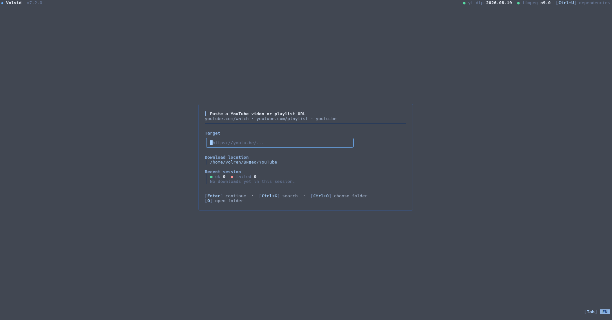

# Volvid

<div align="center">


**Keyboard-driven TUI for downloading YouTube video, audio and thumbnails — via yt-dlp + ffmpeg.**

[](go.mod)
[](#platforms)
[](LICENSE)

</div>

---

## Contents

- [About](#about)
- [Quick Start](#quick-start)
- [TUI Flow](#tui-flow)
- [Controls](#controls)
- [Runtime Paths](#runtime-paths)
- [Architecture](#architecture)
- [Platforms](#platforms)
- [Continuous Integration](#continuous-integration)
- [Troubleshooting](#troubleshooting)
- [Dependencies](#dependencies)

## About



Volvid guides you through update check → dependencies → URL or search → playlist → fragment → profile → audio tracks → subtitles → download → summary. System binaries are preferred; missing ones can be installed as managed copies under the app data dir. `node` is optional (JS runtime). Browser cookies are auto-detected on Windows and Linux. UI language is English/Russian, toggle with `Tab`.

## Quick Start

### Windows (amd64)

Download `Volvid.exe` from the [latest release](https://github.com/VolRencs/Volvid/releases/latest) and run it.

### Linux (amd64)

```bash
curl -L https://github.com/VolRencs/Volvid/releases/latest/download/Volvid -o Volvid
chmod +x Volvid
./Volvid
```

### Build from source

Requires **Go 1.27.1+** (`go.mod`; CI uses `1.27.1`).

```bash
git clone https://github.com/VolRencs/Volvid
cd Volvid
go build -trimpath -buildvcs=false -ldflags="-s -w" -o Volvid ./cmd/downloader
./Volvid
```

Release builds inject the version when `VOLVID_VERSION` is set: `-X volvid/internal/adapters.Version=$VOLVID_VERSION` (see `scripts/build-linux-downloader.sh` and `scripts/build-windows-downloader.sh`).

### Build Windows .exe with icon

Icon source: `assets/icon/icon.ico`.

```bash
go install github.com/akavel/rsrc@v0.10.2
./scripts/build-windows-downloader.sh Volvid.exe
```

## TUI Flow

1. Update + dependency check (`yt-dlp`, `ffmpeg` required; `node` optional).
2. Paste a YouTube link, or press `Ctrl+G` to search.
3. For playlists pick entries with `Space`, `a`, or `/` (manual ranges).
4. Choose Video / Audio / Thumbnail.
5. Video: quality scan (`Best`/`Economy`/height) → output (`Original`, `H264`, `H265`, `VP9`, `AV1`, `MKV-copy`). Audio: `MP3 320k`, `MP3 192k`, `M4A Best`, `Opus Best`, `FLAC`.
6. Video with dubs: pick audio tracks checklist (`Space`, `A` for all) — shown only when 2+ languages exist; then pick subtitles to embed (`Space` multi-select, first row skips). Sidecar `.srt` files are removed, tracks stay inside the container with language tags.
7. Optional fragment for single video/audio (video/audio only): `1:00-2:30`, open-ended `start-` / `start+`, or URL timestamp (`t`/`start`).
8. Playlist downloads ask for worker count; watch progress (`Esc` cancels). Summary keeps session success/failure history.

## Controls

| Key | Scope | Action |
|-----|-------|--------|
| `↑` / `↓` | menus, playlist | Move |
| `1-9` | menus | Jump to item and activate |
| `Enter` | menus, inputs | Continue / confirm |
| `Space` | playlist, subtitles, audio tracks (not in `/`-input) | Toggle entry |
| `a` / `а` | playlist, subtitles, audio tracks | Select all / clear all |
| `/` then `Enter` / `Esc` | playlist | Manual indices / cancel |
| `Ctrl+G` | target screen | YouTube search |
| `Ctrl+U` | when not busy/updating | Dependency management |
| `Ctrl+O` (`Ctrl+Щ`) | target screen | Choose downloads folder |
| `O` (`o`/`щ`/`Щ`; on target screen only `Shift`) | target + summary (if downloads exist) | Open downloads folder |
| `Esc` | everywhere (context) | Back / cancel / leave input |
| `Tab` | everywhere | Switch language EN↔RU |
| any key | update-done screen | Exit |

## Runtime Paths

Defaults use standard user dirs; overrides via env:

| Variable | Role | Default |
|----------|------|---------|
| `VOLVID_CONFIG_DIR` | config (locale, saved folder) | `UserConfigDir/Volvid` |
| `VOLVID_DATA_DIR` | app data | `%LOCALAPPDATA%/Volvid` (win), `$XDG_DATA_HOME` or `~/.local/share/Volvid` (linux) |
| `VOLVID_DEPS_DIR` | managed `yt-dlp`/`ffmpeg`/`node` | `DataDir/deps` |
| `VOLVID_DOWNLOADS_DIR` | lock download location (disables picker) | system `Downloads`, saved choice in `ConfigDir/.volvid_downloads_dir` |

Also: `VOLVID_FFMPEG_SHA256` (pin ffmpeg), `VOLVID_VERSION` (release version injection, both build scripts), `VOLVID_GO_CACHE_ROOT`/`GOCACHE`/`GOMODCACHE` (build cache, `scripts/go-env.sh`).

## Architecture

```text
cmd/downloader/   composition root: adapters.NewEnv + tui.New(env, ctx)
tui/              Bubble Tea UI: screen.go (state machine), menu/flow/keys/bindings,
                  view*.go + deps_*.go (render), checklist.go (track pickers),
                  appapi.go (seam), *_state.go
internal/core/    pure domain, no I/O: target/fragment/clock/profile/deps/probe/
                  decode/sanitize/session
internal/i18n/    UIStrings + locale formatting + profile factories
internal/services/ use-cases: PlanDownload (validation), LaunchProgress (worker)
internal/adapters/ I/O: http/process/request/playlist/ytdlp_scan/probe/quality_scan/
                  release/deps*/download_* + platform paths (downloads_dir_*) and
                  pickers (folder_picker_*)
scripts/          build-linux-downloader.sh, build-windows-downloader.sh, go-env.sh
assets/           logo-1.png, logo-2.png, tui.png, icon/icon.ico
```

```text
cmd/downloader -> tui -> AppAPI (interface)
tui -> core + i18n (pure, no adapters except constructors)
adapters -> core + i18n
services -> core
Production: tui.New(env, ctx) wraps newAppAPI(env). Tests: tui.NewWithDeps(ctx, stubAPI).
```

## Platforms

| OS | Arch | yt-dlp / ffmpeg / node | App update |
|----|------|------------------------|------------|
| Windows | amd64 | system or managed | `*.update.bat` replaces binary after exit |
| Linux | amd64 | system or managed | binary replace |

## Continuous Integration

`checks.yml` (push/PR to `Dev`): `go vet`, `gofmt -l`, `staticcheck`, `go test -race`, build matrix `ubuntu-latest` + `windows-latest` via the two scripts. `build.yml` (on release `published`): version from tag (`VOLVID_VERSION=${GITHUB_REF_NAME#v}`), builds `Volvid.exe` / `Volvid`, uploads with `ncipollo/release-action@v1` (no signing).

## Troubleshooting

**yt-dlp fails to download** — check GitHub access, or install `yt-dlp` system-wide / via dependency screen (`Ctrl+U`).

**“Sign in to confirm you’re not a bot”** — open `Ctrl+U`, check cookies + JS runtime; needs a supported browser profile on the same machine.

**HD merge / audio conversion fails** — needs `ffmpeg` (system or `Ctrl+U`).

**Folder picker won’t open** — unsupported desktop integration; set `VOLVID_DOWNLOADS_DIR` directly.

**Update applied but old version runs (Windows)** — the `.bat` swaps the binary after you close the app; restart once.

## Dependencies

| Component | License |
|-----------|---------|
| [yt-dlp](https://github.com/yt-dlp/yt-dlp) | Unlicense |
| [ffmpeg](https://ffmpeg.org) | LGPL/GPL |
| [Bubble Tea v2](https://charm.land/bubbletea/v2) | MIT |
| [Lip Gloss v2](https://charm.land/lipgloss/v2) | MIT |
| [godbus/dbus](https://github.com/godbus/dbus) | BSD-2-Clause |

Licensed under **GPL-3.0** — see [`LICENSE`](LICENSE).
Copyright (C) 2026 VolRen.
