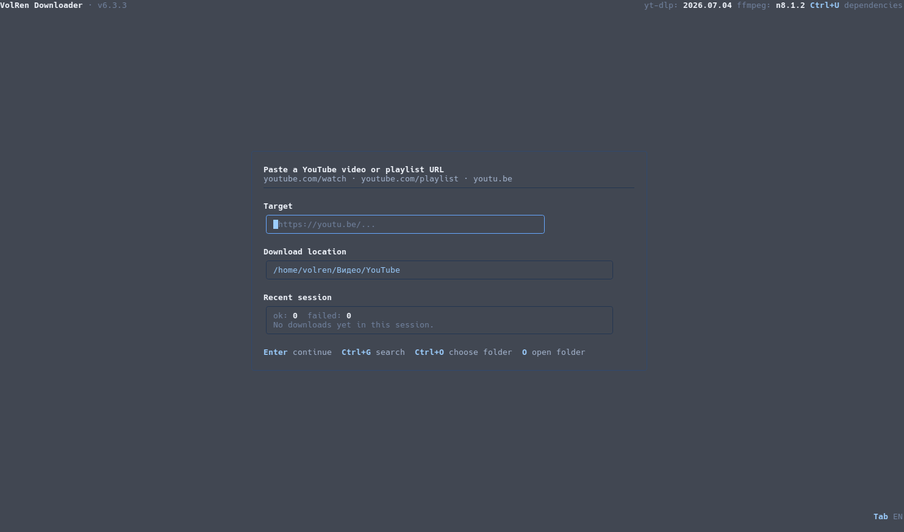

# VolRen Video / Audio Downloader

<div align="center">


**Download YouTube video, audio, and thumbnails through a terminal UI.**


</div>

---

## About



**VolRen Downloader** is a keyboard-driven TUI built around **yt-dlp** and **ffmpeg**.

The application starts with an update and dependency check, then guides the user through target selection, search, playlist handling, profile choice, download progress, and a session summary. System-installed binaries are preferred when available. Managed binaries can also be downloaded into the app data directory. **node** is optional and is used as a JS runtime when available. Browser cookies are auto-detected on **Windows** and **Linux**. The interface supports **English** and **Russian** and can be switched with `Tab`.

## Features

- Unified stage-based TUI: update, dependencies, target, search, playlist, fragment, profile, download, summary
- Video, audio, and thumbnail downloads
- Best and economy video presets with yt-dlp quality scan
- Audio presets for MP3 320k, MP3 192k, M4A/AAC Best, Opus Best, and FLAC
- Optional fragment download for single video or audio jobs
- Open-ended fragments with `start-` / `start+` and URL timestamp support
- YouTube search from the main screen with `Ctrl+G`
- Playlist browser with `Space`, `a`, and manual ranges via `/`
- Managed dependency refresh inside the UI with `Ctrl+U`
- Quick open for the downloads folder from the main screen and summary
- In-app download folder picker on supported platforms
- Per-session summary with success and failure history

## Quick Start

### Windows amd64

Download `VolRenDownloader.exe` from the [latest release](https://github.com/VolRencs/YouTubeDownloader/releases/latest) and run it.

### Linux amd64

```bash
curl -L https://github.com/VolRencs/YouTubeDownloader/releases/latest/download/VolRenDownloader_linux_amd64 -o VolRenDownloader
chmod +x VolRenDownloader
./VolRenDownloader
```

### Build From Source

Requires **Go 1.26.2+**.

```bash
git clone https://github.com/VolRencs/YouTubeDownloader
cd YouTubeDownloader
go build -trimpath -buildvcs=false -ldflags="-s -w" -o VolRenDownloader ./cmd/downloader
./VolRenDownloader
```

### Build Windows Executable With Icon

The repository includes a Windows icon source at `assets/icon/icon.ico`.

```bash
go install github.com/akavel/rsrc@latest
./scripts/build-windows-downloader.sh VolRenDownloader.exe
```

## Runtime Paths

The app uses standard user directories by default and supports overrides through environment variables:

- `VOLREN_CONFIG_DIR` for configuration files
- `VOLREN_DATA_DIR` for application data
- `VOLREN_CACHE_DIR` for cache data
- `VOLREN_DEPS_DIR` for managed binaries
- `VOLREN_DOWNLOADS_DIR` to lock the download location

Managed binaries default to the app data directory under `deps/`. If `VOLREN_DOWNLOADS_DIR` is not set, the TUI can persist a user-selected downloads folder.

## TUI Flow

1. Start at the update and dependency check.
2. Paste a YouTube link on the target screen or press `Ctrl+G` to search.
3. If the target is a playlist, choose entries with `Space`, `a`, or `/`.
4. Choose Video, Audio, or Thumbnail mode.
5. Optionally choose a fragment for single video or audio downloads.
6. Watch progress in the download stage and review the session summary.

On startup:

1. `yt-dlp` and `ffmpeg` are treated as required dependencies.
2. If one of them is missing, the TUI opens the dependency screen before the main target screen.
3. `node` is optional and does not block the app.
4. Browser cookies and JS runtime status are detected automatically.

## Controls

| Key | Action |
|-----|--------|
| `↑` / `↓` | Move in menus |
| `Enter` | Continue |
| `Space` | Select item in playlist view |
| `/` | Enter playlist indices manually |
| `Ctrl+G` | Open YouTube search from the main target screen |
| `Esc` | Leave search or fragment input |
| `a` / `а` | Select all or clear all in playlists |
| `Tab` | Switch UI language |
| `Ctrl+U` | Open dependency management |
| `Ctrl+O` | Choose downloads folder |
| `O` | Open the downloads folder |

## Platforms

| OS | Arch | yt-dlp | ffmpeg | node | App update |
|----|------|--------|--------|------|------------|
| Windows | amd64 | system or managed | system or managed | system or managed | `.bat` replace after close |
| Linux | amd64 | system or managed | system or managed | system or managed | binary replace |

## Source Layout

| Path | Role |
|------|------|
| `cmd/downloader/` | TUI entrypoint |
| `tui/` | Bubble Tea model, events, rendering, and widgets |
| `internal/app/` | runtime helpers: downloads, search, deps, updates, locale, playlists, and HTTP client |
| `scripts/` | build and verification helpers |
| `assets/` | icons and screenshots |

## Troubleshooting

**yt-dlp fails to download**  
Check access to GitHub or install `yt-dlp` system-wide.

**YouTube says “Sign in to confirm you’re not a bot”**  
Open the dependency screen and verify cookies and JS runtime status. If cookies are inactive, make sure a supported browser profile exists on the same machine.

**HD merge or audio conversion fails**  
Make sure `ffmpeg` is available. If it is missing, install it through the dependency screen or provide a system copy.

**Folder selection does not open**  
Check that the current platform has the required desktop integration available. You can still set `VOLREN_DOWNLOADS_DIR` directly.

## Dependencies

| Component | License |
|-----------|---------|
| [yt-dlp](https://github.com/yt-dlp/yt-dlp) | Unlicense |
| [ffmpeg](https://ffmpeg.org) | LGPL/GPL |
| [Bubble Tea v2](https://charm.land/bubbletea/v2) | MIT |
| [Lip Gloss v2](https://charm.land/lipgloss/v2) | MIT |
| [godbus/dbus](https://github.com/godbus/dbus) | BSD-2-Clause |

Project source is **MIT**.

---

<div align="center">

Made by **VolRen**

</div>
